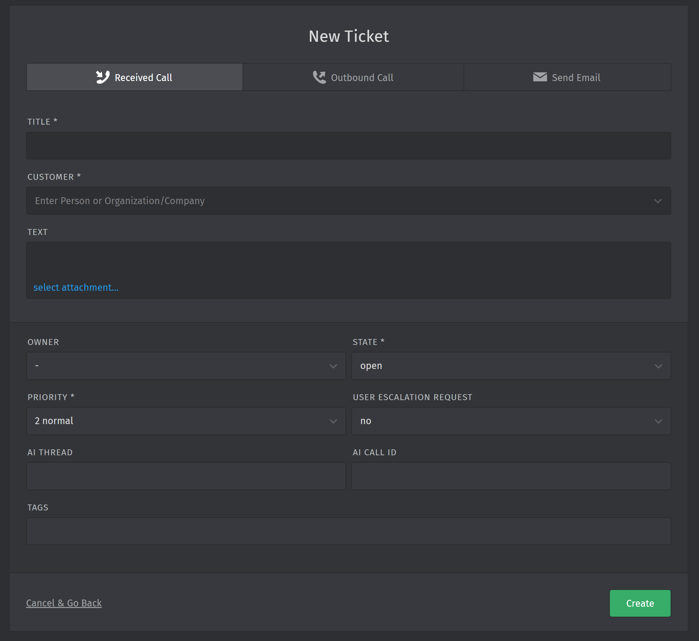

# Creating Tickets

## Standard Procedure

Under normal circumstances, you won't need to create tickets manually. Our AI-powered Remote Intelligent Expert System (AIRES) handles this process automatically for all IT support issues. AIRES creates the ticket, assigns it to itself, and closes it once the issue is resolved.

## Manual Ticket Creation

<figure markdown="span">
    {width="75%"}
    <figcaption>Creating a new chat-type ticket</figcaption>
</figure>

There are, however, special situations where you might need to create tickets manually:

1. If AIRES is temporarily unavailable
2. When handling an escalated call that requires a new ticket

In these cases, you can use the Agent Interface to create a ticket. Look for the green (🟢) + icon in the bottom left corner of your interface.

## Understanding the Ticket Creation Form

<figure markdown="span">
    {width="75%"}
    <figcaption>Creating a new call-type ticket</figcaption>
</figure>

The ticket creation form contains fields configured by your System Administrator. To create a ticket:

1. Fill out all required fields in the form
2. Click the green (🟢) "Create" button

### Special Fields

While most fields are self-explanatory, there are two fields that AIRES uses which you don't need to interact with:

1. **AI THREAD**: This is the ID of the conversation associated with the ticket. AIRES uses this to retrieve the correct context of the user's issue.

2. **AI CALL ID**: This field stores the ID of the call associated with the ticket.

These fields are automatically populated by the system and don't require your input or modification.

## Best Practices for Manual Ticket Creation

When creating tickets manually, keep these tips in mind:

1. Be as detailed as possible in describing the issue
2. Use clear and concise language to ensure easy understanding for other agents who might handle the ticket later
3. If creating a ticket for an escalated call, make sure to note any previous interactions or ticket numbers related to the issue

Remember, manual ticket creation should be the exception rather than the rule. Always rely on AIRES for standard ticket creation unless special circumstances require your intervention.

feat: documentation content, better structure

This commit introduces several changes to improve the documentation structure and user interface:

1. Theme and UI Enhancements:
   - Changed primary color from blue to black in mkdocs.yml
   - Added navigation tabs and footer
   - Removed table of contents integration
   - Enabled emoji support

2. Content Expansion and Refinement:
   - Rewrote and expanded "Navigating Your Workspace" (docs/agent-manual/2-tour.md)
     * Added detailed explanations of dashboard, recent tickets, and ticket details
     * Included sections on AI Assistant functionality and ticket management
   - Rewrote "Creating Tickets" (docs/agent-manual/tickets/2-create.md)
     * Clarified standard procedures and manual ticket creation processes
     * Added best practices for manual ticket creation
   - Rewrote "Following Up on Tickets" (docs/agent-manual/tickets/3-follow-up.md)
     * Expanded on article types and their significance
     * Detailed processes for taking over from AIRES and following up on different ticket types
     * Added section on SLA management and best practices for follow-ups
