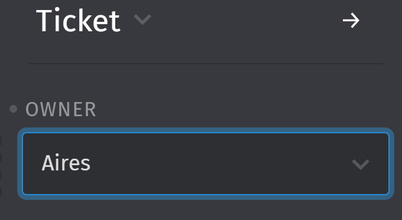
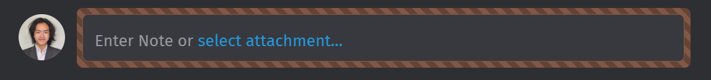
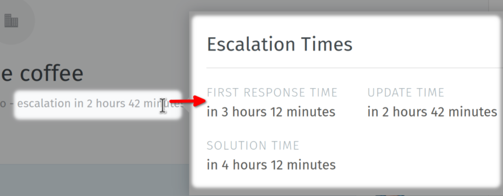

# Following Up on Tickets

## Understanding Articles

In WhatsApp and Email tickets, you'll see a live conversation between the user and AIRES. Each chat bubble, called an "article," represents a message that has been or will be sent to the customer, whether created by you or AIRES.

!!! note
    Article types are crucial. "Note" type articles are only visible within the ticket, while "WhatsApp message" or "email" types are actually sent to the customer, regardless of their internal status.

!!! note
    All articles are non-editable and cannot be deleted. Ensure accuracy before sending.

## Taking Over from AIRES

Before responding to a customer, you need to disable the AIRES system:

1. Locate the "owner" field in the ticket metadata.
2. Replace "AIRES" with your name.

<figure markdown="span">
    {width="50%"}
    <figcaption>Changing ticket ownership</figcaption>
</figure>

!!! note
    AIRES will automatically unassign itself from the "owner" field when it determines escalation is necessary.

!!! warning
    Only take over from AIRES when absolutely necessary. If you do, ensure a smooth transition in the conversation with the customer.

## Following Up on Call-Type Tickets

For call-type tickets, most articles in the history tab are call notes. These are visible to the customer as well. To follow up:

1. Review the ticket summary.
2. Toggle the customer information view in the ticket metadata section.
3. Click the phone icon to call the customer.
4. During the call, prepare to note down:
   - Your reason for calling
   - Key points discussed during the call
   - Any actions or commitments made
   - Follow-up tasks or next steps
   - Customer's current satisfaction level
   - Any escalation requirements
5. After the call, type your message and press send.

<figure markdown="span">
    {width="75%"}
    <figcaption>Message input box</figcaption>
</figure>

For internal messages, click the lock icon near the send button. The chat input box will turn yellow like the one above, indicating an internal note.

!!! warning
    Let's achieve transparency with our customers, and avoid setting internal messages whenever possible.

## Following Up on WhatsApp & Email-Type Tickets

In these tickets, articles represent actual conversations between you and the customer, with occasional internal notes. To follow up:

1. Ensure you're the ticket owner.
2. Review the ticket summary.
3. Type your message. For emails, note that a signature is automatically added at the bottom.
4. Send your message/email to the customer.

For internal messages, follow the same procedure as with call-type tickets.

## Managing SLAs

You can view SLA (Service Level Agreement) information below the ticket title at the top of the interface.

<figure markdown="span">
    {width="75%"}
    <figcaption>SLA display</figcaption>
</figure>

SLA configurations are managed by your System Administrator. Always be mindful of these time constraints when following up on tickets.

## Best Practices for Following Up

1. Review the ticket summary
2. Maintain a consistent tone and style in your communications.
3. Always respect SLA timelines when planning your follow-ups.