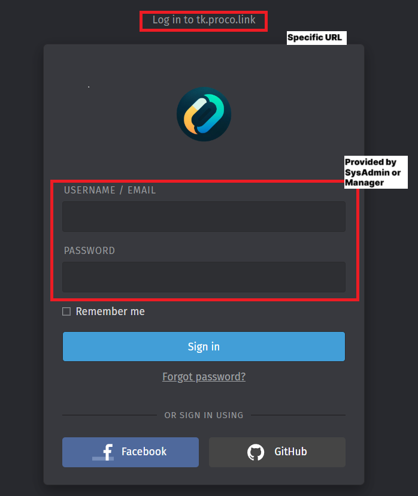
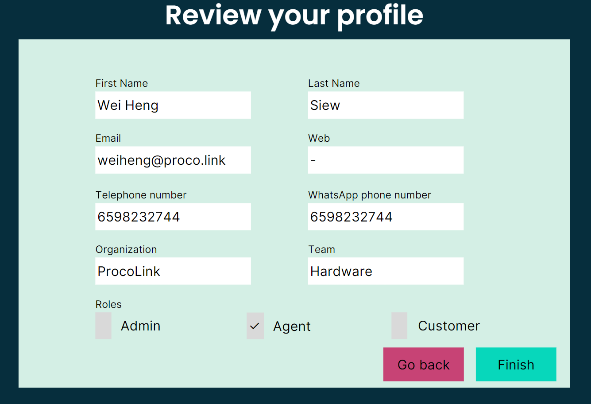
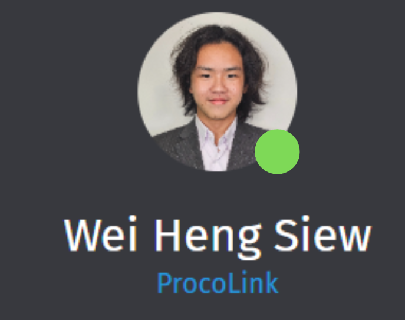

To access the agent UI, you would receive a specific URL they can use to log into the system. The system administrator, or the agent's manager, will provide this URL, as well as an assigned username and password.

- When you log into the platform, you will see a configuration login screen depending on how your administrator configures the system:
<figure markdown="span">
    {width="75%"}
    <figcaption>Login page</figcaption>
</figure>

- After entering your credentials, you will have to review your user profile that your system administrator has set:

<figure markdown="span">
{width="75%"}
<figcaption>Review profile</figcaption>
</figure>

- Once fully logged in, you will likely find yourself in a Connected session, meaning you can take calls and answer to WhatsApp messages:

<figure markdown="span">
{width="25%"}
<figcaption>Connected session</figcaption>
</figure>

Next, you select a state that lets the system know your availability status. Once you mark yourself as available, the system will immediately begin routing the right tickets to you, according to your or your team's profile, that has been configured by the system admin.

At this point, you are ready to start resolving tickets.